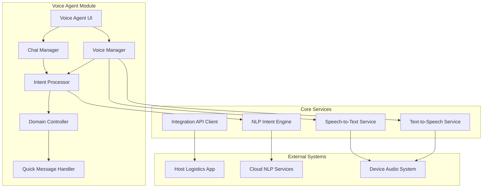

# Design Document

## Overview

The Voice Agent is a React Native mobile module that provides voice-first AI assistance for delivery partners in logistics systems. The system enables hands-free interaction through voice commands and provides a fallback chat interface, while strictly maintaining delivery-related scope to ensure driver safety and focus.

The architecture follows a modular, integration-ready design that can be embedded into existing logistics applications through REST APIs. The system prioritizes low-latency responses, offline capabilities, and minimal battery consumption.

## Architecture

### High-Level Architecture



### Component Architecture

The system follows a layered architecture with clear separation of concerns:

1. **Presentation Layer**: React Native UI components for voice and chat interfaces
2. **Business Logic Layer**: Intent processing, domain control, and message handling
3. **Service Layer**: Speech recognition, text-to-speech, and NLP processing
4. **Integration Layer**: REST API client for host application communication

## Components and Interfaces

### Voice Manager Component

**Purpose**: Manages voice input/output lifecycle and coordinates speech services.

**Key Responsibilities**:
- Voice activation (push-to-talk, tap-to-speak)
- Audio input capture and preprocessing
- Speech-to-text conversion coordination
- Text-to-speech output management
- Noise handling and audio quality optimization

**Interface**:
```typescript
interface VoiceManager {
  startListening(mode: 'push-to-talk' | 'tap-to-speak'): Promise<void>
  stopListening(): void
  speak(text: string, priority: 'high' | 'normal'): Promise<void>
  setNoiseReduction(enabled: boolean): void
  getAudioQuality(): AudioQualityMetrics
}
```

### Intent Processor Component

**Purpose**: Converts user input (voice or text) into actionable delivery system commands.

**Key Responsibilities**:
- Natural language understanding for delivery contexts
- Intent classification and entity extraction
- Command validation and parameter extraction
- Context awareness for delivery state

**Interface**:
```typescript
interface IntentProcessor {
  processInput(input: string, context: DeliveryContext): Promise<Intent>
  validateIntent(intent: Intent): boolean
  extractEntities(input: string): Entity[]
  updateContext(context: DeliveryContext): void
}

interface Intent {
  type: 'delivery_status' | 'navigation' | 'communication' | 'quick_message'
  action: string
  parameters: Record<string, any>
  confidence: number
}
```

### Domain Controller Component

**Purpose**: Enforces delivery-only scope and prevents off-topic interactions.

**Key Responsibilities**:
- Intent whitelist validation
- Off-topic request rejection
- Safety-focused response filtering
- Interaction logging for monitoring

**Interface**:
```typescript
interface DomainController {
  validateIntent(intent: Intent): ValidationResult
  getApprovedIntents(): string[]
  logRejectedQuery(query: string, reason: string): void
  generateRejectionResponse(): string
}
```

### Quick Message Handler Component

**Purpose**: Manages predefined delivery status messages for rapid communication.

**Key Responsibilities**:
- Predefined message template management
- One-tap message sending
- Voice-triggered message selection
- Message customization based on context

**Interface**:
```typescript
interface QuickMessageHandler {
  getAvailableMessages(context: DeliveryContext): QuickMessage[]
  sendMessage(messageId: string, customization?: string): Promise<void>
  registerVoiceTrigger(phrase: string, messageId: string): void
}

interface QuickMessage {
  id: string
  template: string
  voiceTriggers: string[]
  category: 'status' | 'delay' | 'contact' | 'location'
}
```

### Integration API Client Component

**Purpose**: Handles communication with host logistics applications.

**Key Responsibilities**:
- REST API communication
- Authentication token management
- Data synchronization with host system
- Configuration updates from host

**Interface**:
```typescript
interface IntegrationAPIClient {
  authenticate(token: string): Promise<boolean>
  syncDeliveryData(): Promise<DeliveryContext>
  sendStatusUpdate(update: StatusUpdate): Promise<void>
  getConfiguration(): Promise<VoiceAgentConfig>
  registerEventCallback(event: string, callback: Function): void
}
```

## Data Models

### Core Data Structures

```typescript
interface DeliveryContext {
  partnerId: string
  currentDeliveries: Delivery[]
  activeRoute: Route
  vehicleStatus: VehicleStatus
  location: GeoLocation
  workingHours: TimeRange
}

interface Delivery {
  id: string
  status: 'pending' | 'picked_up' | 'in_transit' | 'delivered' | 'failed'
  pickupLocation: Address
  deliveryLocation: Address
  customerInfo: CustomerInfo
  estimatedTime: Date
  specialInstructions?: string
}

interface VoiceAgentConfig {
  enabledFeatures: string[]
  voiceSettings: VoiceSettings
  integrationEndpoints: APIEndpoints
  domainRestrictions: DomainRestrictions
}

interface AudioQualityMetrics {
  noiseLevel: number
  signalStrength: number
  recognitionAccuracy: number
  latency: number
}
```

### Message Templates

```typescript
const QUICK_MESSAGES: QuickMessage[] = [
  {
    id: 'reached_pickup',
    template: 'Reached pickup location for order {orderId}',
    voiceTriggers: ['reached pickup', 'at pickup location', 'pickup ready'],
    category: 'location'
  },
  {
    id: 'reached_delivery',
    template: 'Reached delivery location for order {orderId}',
    voiceTriggers: ['reached delivery', 'at delivery location', 'delivery ready'],
    category: 'location'
  },
  {
    id: 'traffic_delay',
    template: 'Delayed due to traffic, estimated {minutes} minutes late',
    voiceTriggers: ['traffic delay', 'stuck in traffic', 'running late'],
    category: 'delay'
  },
  {
    id: 'customer_unavailable',
    template: 'Unable to contact customer for order {orderId}',
    voiceTriggers: ['customer not available', 'no answer', 'cannot contact'],
    category: 'contact'
  }
]
```

## Correctness Properties

*A property is a characteristic or behavior that should hold true across all valid executions of a system-essentially, a formal statement about what the system should do. Properties serve as the bridge between human-readable specifications and machine-verifiable correctness guarantees.*

### Property 1: Voice Input Processing
*For any* valid voice command from a delivery partner, the Voice_Agent should capture, process, and respond within 2 seconds under normal conditions
**Validates: Requirements 1.1, 1.2, 6.1**

### Property 2: Intent Execution Consistency
*For any* valid delivery command processed by the Intent_Processor, the Voice_Agent should execute the corresponding system action correctly
**Validates: Requirements 1.3**

### Property 3: Audio Feedback Completeness
*For any* system action or response, the Voice_Agent should provide appropriate audio confirmation to the delivery partner
**Validates: Requirements 1.4, 3.5, 7.3**

### Property 4: Activation Mode Support
*For any* voice activation request, the Voice_Agent should support both push-to-talk and tap-to-speak modes effectively
**Validates: Requirements 1.5**

### Property 5: Noise Resilience
*For any* voice input under varying noise conditions, the Voice_Agent should maintain acceptable speech recognition accuracy
**Validates: Requirements 1.6**

### Property 6: Context Preservation
*For any* mode switch between voice and chat or context update, the Voice_Agent should maintain conversation and delivery context consistently
**Validates: Requirements 2.5, 8.5**

### Property 7: Text Processing Parity
*For any* delivery-related text query, the Intent_Processor should process it with the same accuracy as equivalent voice commands
**Validates: Requirements 2.2**

### Property 8: Domain Restriction Enforcement
*For any* non-delivery-related query, the Domain_Controller should reject the request and respond with delivery-only guidance
**Validates: Requirements 4.1, 4.2, 4.4**

### Property 9: Quick Message Reliability
*For any* quick message trigger (voice or touch), the Voice_Agent should send the appropriate status update correctly
**Validates: Requirements 3.2, 3.3**

### Property 10: Integration API Consistency
*For any* valid API request with proper authentication, the Integration_API should respond with correct JSON data and maintain secure communication
**Validates: Requirements 5.1, 5.3, 5.6**

### Property 11: Context Synchronization
*For any* delivery data update from the host system, the Voice_Agent should update its internal context and reflect changes in responses
**Validates: Requirements 5.2, 8.1, 8.2**

### Property 12: Status Change Notification
*For any* delivery status change initiated through the Voice_Agent, the system should notify the host application via API callbacks
**Validates: Requirements 5.4**

### Property 13: Performance Optimization
*For any* device configuration and network condition, the Voice_Agent should maintain smooth performance while minimizing battery consumption
**Validates: Requirements 6.2, 6.3**

### Property 14: Graceful Degradation
*For any* network connectivity issue, the Voice_Agent should handle requests gracefully using cached data and appropriate fallbacks
**Validates: Requirements 6.4, 6.5**

### Property 15: Hands-Free Operation
*For any* delivery partner interaction, the Voice_Agent should function effectively without requiring visual attention or two-handed operation
**Validates: Requirements 7.1, 7.5**

### Property 16: Safety-First Interface
*For any* driving mode activation or safety situation, the Voice_Agent should prioritize voice interactions and minimize visual distractions
**Validates: Requirements 7.2, 7.4**

### Property 17: Delivery Context Awareness
*For any* context-dependent query about deliveries, navigation, or status, the Voice_Agent should provide accurate responses based on current delivery state
**Validates: Requirements 8.1, 8.2, 8.3, 8.4**

## Error Handling

### Voice Recognition Errors
- **Timeout Handling**: If speech recognition exceeds 5 seconds, prompt user to try again
- **Low Confidence**: If recognition confidence < 70%, ask for clarification
- **No Speech Detected**: Provide audio prompt after 3 seconds of silence
- **Audio Quality Issues**: Automatically adjust noise reduction and suggest optimal positioning

### Network and API Errors
- **Connection Failures**: Fall back to cached data and queue updates for retry
- **Authentication Errors**: Prompt for re-authentication and maintain session state
- **Rate Limiting**: Implement exponential backoff with user notification
- **Timeout Errors**: Retry with progressive timeout increases (2s, 5s, 10s)

### Intent Processing Errors
- **Ambiguous Commands**: Ask clarifying questions with suggested options
- **Invalid Parameters**: Request missing information with context-aware prompts
- **Domain Violations**: Politely redirect to delivery-related topics
- **System State Conflicts**: Explain current state and suggest valid actions

### Integration Errors
- **Host System Unavailable**: Cache actions locally and sync when available
- **Data Synchronization Failures**: Retry with conflict resolution strategies
- **Configuration Errors**: Fall back to default settings with user notification
- **Version Mismatches**: Gracefully handle API version differences

## Testing Strategy

### Dual Testing Approach

The Voice Agent will be validated through both unit testing and property-based testing to ensure comprehensive coverage:

**Unit Tests** focus on:
- Specific voice command examples and expected responses
- Edge cases like network failures and low battery scenarios
- Integration points between voice, chat, and API components
- Error conditions and recovery mechanisms

**Property-Based Tests** focus on:
- Universal properties that hold across all valid inputs
- Comprehensive input coverage through randomized voice commands
- Performance characteristics under varying conditions
- Domain restriction enforcement across diverse query types

### Property-Based Testing Configuration

- **Testing Framework**: Use fast-check for JavaScript/TypeScript property-based testing
- **Test Iterations**: Minimum 100 iterations per property test for statistical confidence
- **Voice Input Generation**: Create generators for realistic delivery-related voice commands
- **Context Generation**: Generate varied delivery contexts (different routes, statuses, locations)
- **Network Condition Simulation**: Test under various network latency and reliability conditions

### Test Tag Format
Each property-based test will be tagged with:
**Feature: voice-agent, Property {number}: {property_text}**

### Key Testing Areas

1. **Voice Recognition Accuracy**: Test speech-to-text conversion across accents, noise levels, and command variations
2. **Intent Classification**: Validate correct intent extraction from diverse phrasings of delivery commands
3. **Response Latency**: Ensure sub-2-second response times across different system loads
4. **Domain Boundary**: Test rejection of non-delivery queries while accepting all valid delivery commands
5. **Context Consistency**: Verify context preservation across mode switches and system updates
6. **Integration Reliability**: Test API communication under various network conditions and error scenarios
7. **Battery Efficiency**: Monitor power consumption during extended voice interaction sessions
8. **Safety Compliance**: Validate hands-free operation and minimal visual distraction requirements

### Mock and Simulation Strategy

- **Voice Input Simulation**: Use synthetic speech generation for consistent testing
- **Network Condition Mocking**: Simulate various latency, bandwidth, and reliability scenarios
- **Device Performance Simulation**: Test on emulated low-end device specifications
- **Host System Mocking**: Create mock logistics API for integration testing
- **Real-World Scenario Testing**: Include actual delivery partner feedback sessions